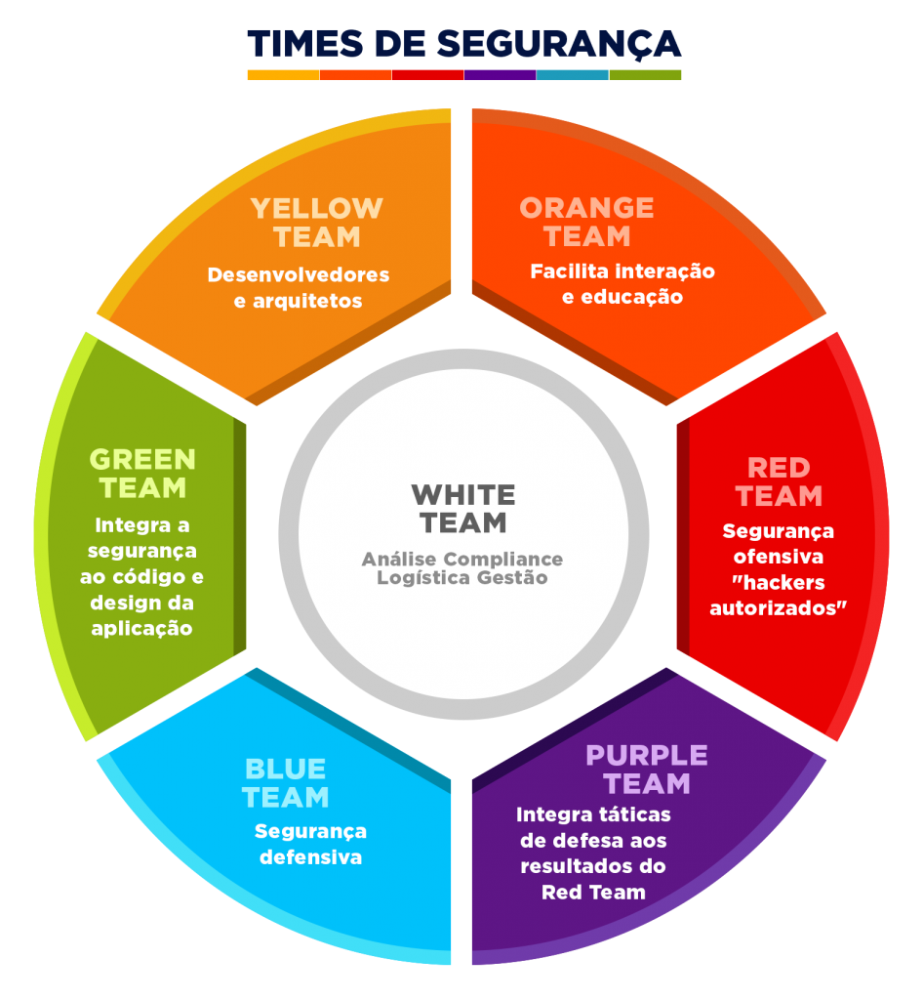

# 🖥️ Network

O **HackThebox** tem guias de Entry-Level bem legais para quem está iniciando. São 13 máquinas gratuitas de Entry Level e sugiro veementemente vocês fazerem elas.



<figure><figcaption></figcaption></figure>

Caso você tenha alguma dúvida, elas também possuem guias/write-ups bem detalhados disponíveis, basta clicar aqui:

<figure><figcaption></figcaption></figure>
